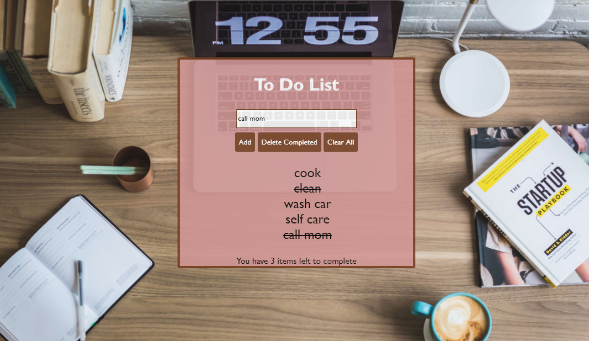

# To Do List
There's no need to waste anymore pen and paper on a to do list, when you can have it handy in your computer! On this site you can type in an item into the form and add it to your list. You can cross out each item as you complete it, delete completed items, or delete the entire list once everything is done.
## **Link to project:** https://kr-todolist.netlify.app/

## How It's Made:
**Tech used:** HTML, CSS and JavaScript

## Lessons Learned:
The to do list required a lot of small things, coming together to make it work. I learned more about event listeners, and adding elements like list items throughJavascript. I also called a class in JavaScript from CSS for the first time, so that was pretty neat.
